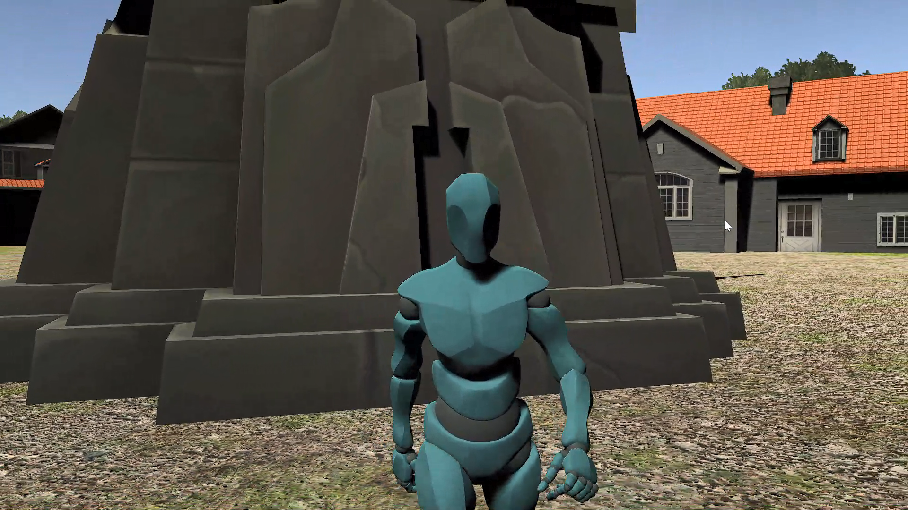
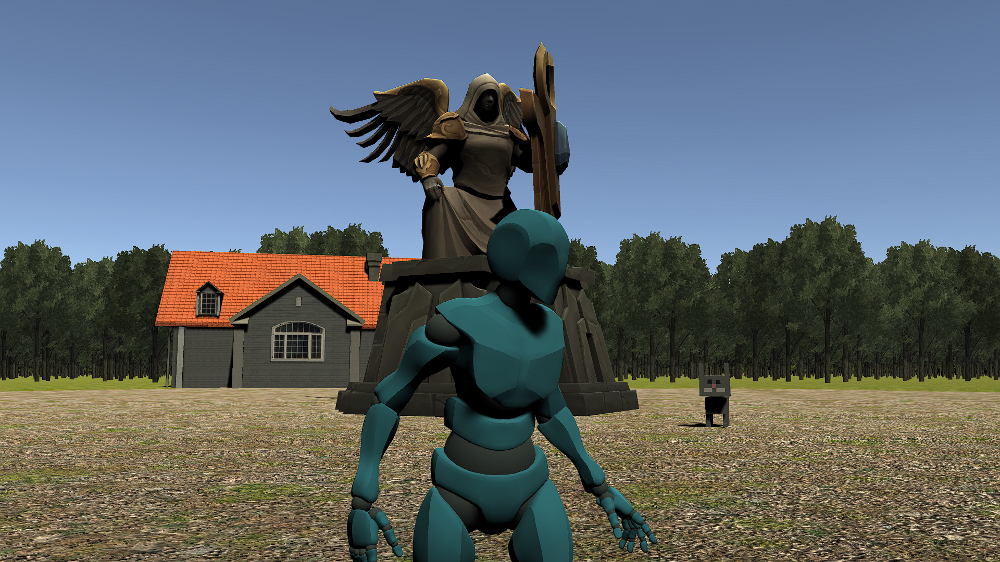
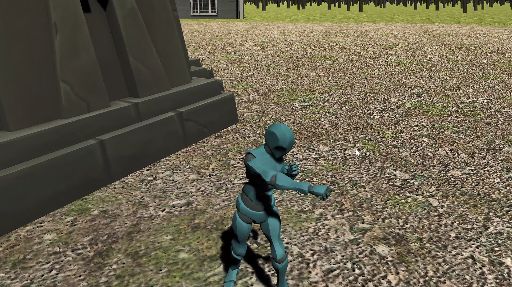
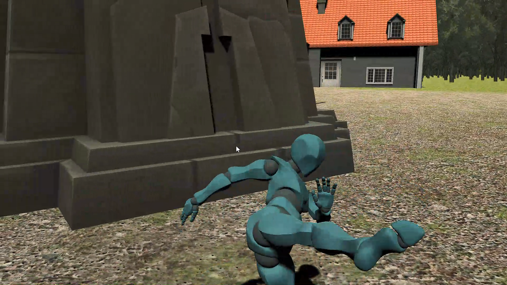
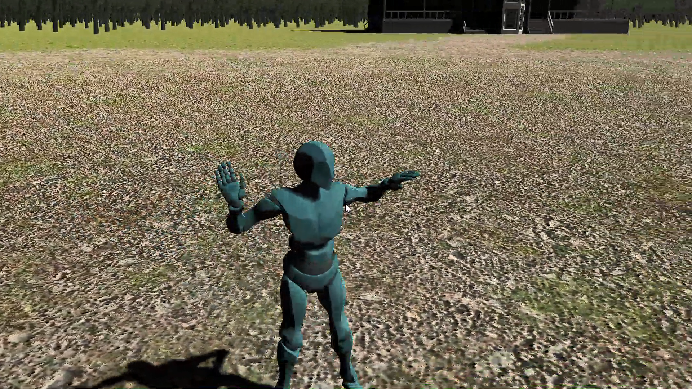
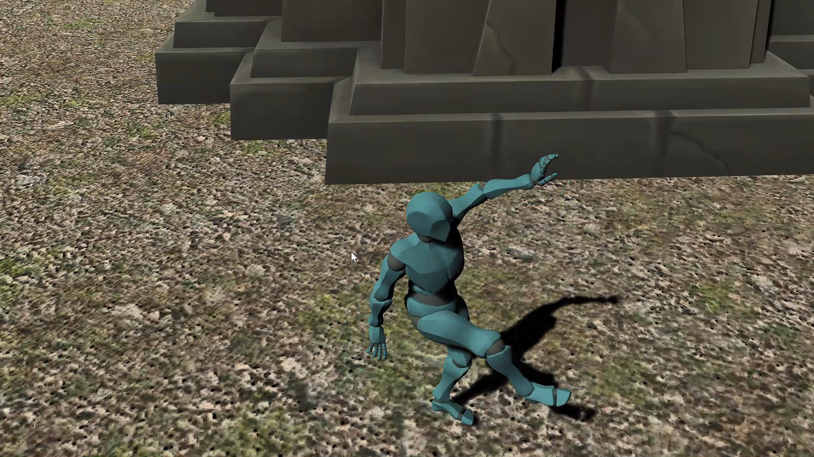
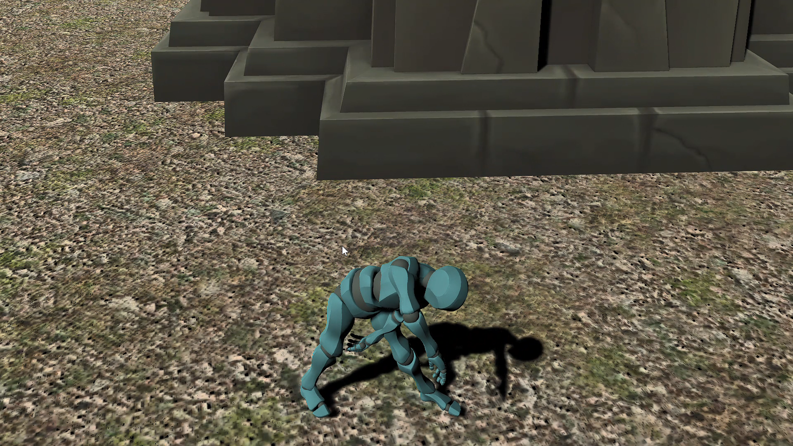
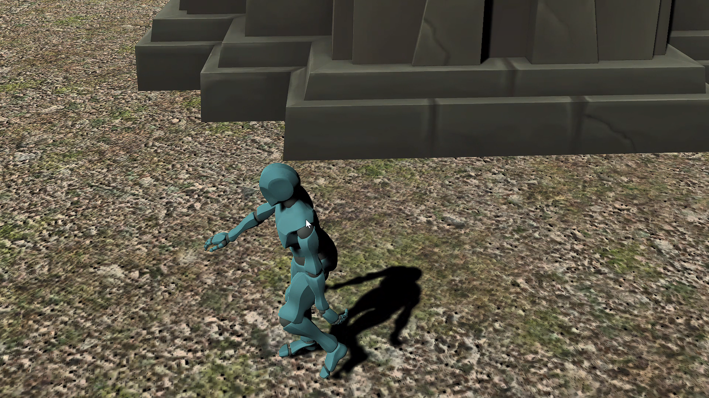

# Open_World_Game

Hello Developer

This is a Open World Game , this project includes player movements like Idle, Walk, Run, Jump, Jump to Stand, Jump to Walk, Jump to Run, Crouch, Crouch Walking, 
Crouch to Running. with extra Features that includes Dancing.

Thank you!

Star⭐ the repo if you like what you see

Images are from Project
## 📸 ScreenShots

|------|
||
||
||
||
||
||
||
||
||
||
|------|

⭐  Controlls  ⭐

W,A,S,D = MOVEMENT
LEFT MOUSE CLICK(HOLD) = PUNCH
RIGHT MOUSE CLICK(HOLD) = KICK
SPACE = JUMP
RIGHT SHIFT(HOLD) = SPRINT
1(HOLD) = DANCE 1
2(HOLD) = DANCE 2

## ✨ Requirements
* Any Operating System (ie. MacOS X, Linux, Windows)
* 1 GB Ram
* NO GPU REQUIRED
* INTEL I3 6TH GEN PROCESSOR

## 🤓 Author
* Email : nihalpadwal@gmail.com

## Getting Started

This project uses Unity Game Engine and C# programming language

Unity is a cross-platform game engine developed by Unity Technologies, first announced and released in June 2005 at Apple Inc.'s Worldwide Developers Conference as a Mac OS X-exclusive game engine.

## LICENCE
 MIT License

Copyright (c) 2021 Nihal Padwal

Permission is hereby granted, free of charge, to any person obtaining a copy
of this software and associated documentation files (the "Software"), to deal
in the Software without restriction, including without limitation the rights
to use, copy, modify, merge, publish, distribute, sublicense, and/or sell
copies of the Software, and to permit persons to whom the Software is
furnished to do so, subject to the following conditions:

The above copyright notice and this permission notice shall be included in all
copies or substantial portions of the Software.

THE SOFTWARE IS PROVIDED "AS IS", WITHOUT WARRANTY OF ANY KIND, EXPRESS OR
IMPLIED, INCLUDING BUT NOT LIMITED TO THE WARRANTIES OF MERCHANTABILITY,
FITNESS FOR A PARTICULAR PURPOSE AND NONINFRINGEMENT. IN NO EVENT SHALL THE
AUTHORS OR COPYRIGHT HOLDERS BE LIABLE FOR ANY CLAIM, DAMAGES OR OTHER
LIABILITY, WHETHER IN AN ACTION OF CONTRACT, TORT OR OTHERWISE, ARISING FROM,
OUT OF OR IN CONNECTION WITH THE SOFTWARE OR THE USE OR OTHER DEALINGS IN THE
SOFTWARE.
